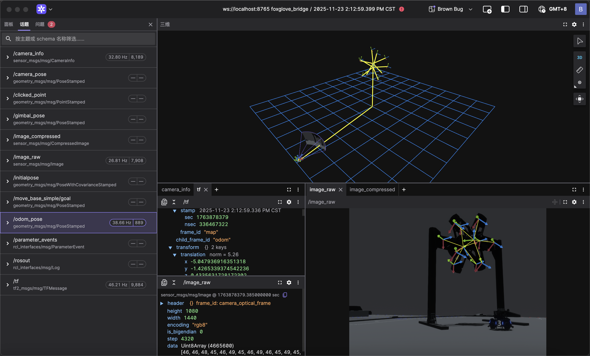

# 🧪 Daedalus

**RoboMaster 视觉算法验证模拟器**

*为算法而生的实验场，让自瞄在上场前就经历真实考验*

## 🚀 功能亮点

* 🎯 **全要素战场环境仿真**
  覆盖能量机关、前哨站、大/小装甲模块等 RoboMaster 核心视觉目标，提供高保真的外观与状态模拟。

* 🤖 **多机器人模型与行为**
  支持步兵（Infantry）与英雄（Hero）机器人的移动、底盘旋转、云台控制与弹丸发射。

* 🔄 **算法-数据-控制完整闭环**
  原生打通 **图像采集 → 目标标注 → ROS2/Talos 推理 → 云台反馈**，实现“看-算-打”全流程验证。

* 📊 **仿真数据集一键生成**
  支持**所有大/小装甲模块仿真数据集**导出，为检测算法训练、验证与对拍提供高质量数据。

* ⚔️ **多主体动态对抗模拟**
  己方与多个假人独立控制，支持 Tab 键实时切换，真实构造遮挡、对抗与复杂战场场景。

* 🚀 **双通道实时通信接口**
    - **ROS2 原生集成**：直接发布图像、TF 与位姿话题，零成本接入现有自瞄系统
    - **Talos 零拷贝 IPC**：与 [talos](https://github.com/Blackjack200/talos) 通过共享内存通信，支持实时姿势发布与云台命令订阅

* ⚡️ **高性能实时渲染管线**
  基于 Bevy 引擎，支持 CPU/GPU 渲染，保证高帧率与严格的时间一致性。

---

## 🎨 功能覆盖与开发路线

### ✅ 已实现

#### 🏟️ 战场环境仿真

* **能量机关完整仿真** - 大/小能量机关的激活流程与视觉状态模拟
* **前哨站完整仿真** - 前哨站外观与装甲模块状态模拟
* **装甲模块建模与渲染** - 大、小装甲模块全部图案双色灯条显示

#### 🤖 机器人模型与行为

* **步兵机器人（Infantry）** - 移动、底盘旋转、云台控制、17mm弹丸发射
* **英雄机器人（Hero）** - 大装甲模块专属配置、移动与发射行为
* **物理动力学模拟** - 基于物理的移动、旋转与碰撞响应

#### 🔌 通信接口集成

* **ROS2 原生集成** - 发布 `/image_raw`、`/camera_info`、`/tf` 等话题，订阅 `/armor_solver/cmd_gimbal`
* **Talos 共享内存 IPC** - 与 C++ talos-cpp 零拷贝通信，发布 odom/gimbal/muzzle/camera 姿势，订阅云台控制命令

#### 📊 数据生成与工具

* **仿真数据集导出** - 支持**所有大/小装甲模块仿真数据集**一键导出，用于训练与算法验证
* **控制指令订阅** - 支持 ROS2 与 Talos 双通道控制指令接入
* **假人控制切换** - Tab 键实时切换活动假人，支持多机器人测试场景

#### ⚡️ 渲染与性能

* **高性能实时渲染管线** - 基于 Bevy 引擎，CPU/GPU 渲染支持，保证高帧率与时间一致性
* **多视角观测系统** - 自由视角、第一人称、第三人称视角切换（F3键）

---

### 🔄 近期计划

* **能量机关仿真数据集导出**
* **ROS2 自定义相机外参支持**

---

### 🚀 规划中功能

* **多机器人协同仿真**（步兵 / 英雄 / 哨兵）
* **弹道模拟与落点校准验证**
* **相机成像参数模拟**（曝光、白平衡、畸变）
* **多光照条件与环境变化模拟**

---

## 💡 使用说明

### ROS2 接口

**发布话题**

* `/camera_info`
* `/image_raw` / `image_compressed`
* `/tf`
* `/gimbal_pose`
* `/odom_pose`
* `/camera_pose`

**订阅话题**

* `/armor_solver/cmd_gimbal`

### Talos 共享内存接口

**发布姿势**（零拷贝共享内存）

* `odom` - 底盘里程计姿势
* `gimbal` - 云台旋转姿势
* `muzzle` - 枪口偏移姿势
* `camera` - 相机外参姿势

**订阅命令**

* `gimbal_cmd` - 云台控制命令（含开火建议）

---

### 控制方式

#### 己方 Infantry

| 功能   | 按键              |
|------|-----------------|
| 移动   | `W` `A` `S` `D` |
| 底盘旋转 | `Q` `E`         |
| 发射弹丸 | `Space`         |
| 云台旋转 | `↑` `↓` `←` `→` |

#### 假人 Infantry

| 功能   | 按键              |
|------|-----------------|
| 移动   | `I` `J` `K` `L` |
| 底盘旋转 | `U` `O`         |
| 云台旋转 | `F` `V` `C` `B` |

#### 假人切换

* **Tab**：切换活动假人控制权（在多个假人之间循环切换）

#### 自由视角

| 功能   | 操作                        |
|------|---------------------------|
| 移动   | `W` `A` `S` `D` + `N` `J` |
| 视角旋转 | 鼠标拖动                      |

---

### 视角切换

* **F3**：切换视角模式

    * 自由视角：全局观察，适合算法调试
    * 第一人称：操作手视角
    * 第三人称：机器人行为分析

---

### 实用功能

* **F2**：截图（含标注信息）
* **F4**：调试信息开关
* **F5**：自瞄订阅开关
* **1**：采集一帧仿真数据

---

## 📝 项目信息

* **作者**：Blackjack200
* **团队**：Actor&Thinker 战队
* **技术栈**：Rust · Bevy · ROS2(r2r) · Talos IPC
* **交流方式**：GitHub Issues / Pull Requests
* **开源协议**：AGPL v3

---

## 🌄 演示

    

---

## 📜 开源协议说明

本项目采用 **AGPL v3** 协议。

我们选择开放仿真基础设施，是因为 RoboMaster 视觉算法的发展依赖于**可复现的实验环境**。
通过开放核心能力，希望为社区提供一个可靠的起点，让更多战队能够在此基础上进行验证、扩展与创新。
